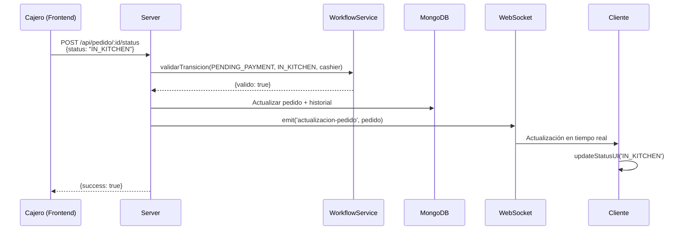

# 🔄 IMPLEMENTACIÓN: WORKFLOW DE ESTADOS DE PEDIDOS

**Fecha:** 2026-02-17  
**Módulo:** Sistema de Estados con Validación de Roles  
**Estado:** ✅ IMPLEMENTADO

---

## 📋 RESUMEN

Se ha implementado un sistema completo de workflow para gestión de estados de pedidos con:
- ✅ Máquina de estados con 5 estados definidos
- ✅ Validación de transiciones por rol
- ✅ Prevención de retroceso de estados
- ✅ Actualizaciones en tiempo real vía WebSocket
- ✅ Historial de cambios con auditoría
- ✅ Notificaciones visuales para clientes

---

## 🎯 FLUJO DE ESTADOS

```
PENDING_PAYMENT (Recibido)
        ↓ Cajero cobra
IN_KITCHEN (En Cocina)
        ↓ Cocina inicia
PREPARING (Preparando)
        ↓ Cocina termina
READY (Listo)
        ↓ Cajero entrega
COMPLETED (Entregado)
```

### Estados Detallados:

| Estado | Código | Descripción | Icono | Color |
|--------|--------|-------------|-------|-------|
| Recibido | `PENDING_PAYMENT` | Pedido recibido, esperando pago | 💰 | Amarillo |
| En Cocina | `IN_KITCHEN` | Pagado, enviado a cocina | 🍳 | Naranja |
| Preparando | `PREPARING` | Cocina está preparando | 👨‍🍳 | Azul |
| Listo | `READY` | Listo para entregar | ✅ | Verde |
| Entregado | `COMPLETED` | Pedido completado | 📦 | Gris |

---

## 🔐 PERMISOS POR ROL

### Cajero (`cashier`)
```
PENDING_PAYMENT → IN_KITCHEN  (Cobra el pedido)
READY → COMPLETED             (Entrega el pedido)
```

### Cocina (`cook`)
```
IN_KITCHEN → PREPARING  (Inicia preparación)
PREPARING → READY       (Termina preparación)
```

### Admin (`admin`)
```
Puede realizar CUALQUIER transición
(Control total del flujo)
```

### Reglas Globales:
- ❌ **NO se puede retroceder estados**
- ❌ **NO se puede saltar estados** (excepto admin)
- ✅ **Cada cambio queda registrado** en historial

---

## 📁 ARCHIVOS CREADOS/MODIFICADOS

### 1. [`services/workflow.service.js`](services/workflow.service.js) ⭐ NUEVO

**Servicio central de workflow** que gestiona toda la lógica de estados.

#### Funciones Principales:

```javascript
// Valida si una transición es permitida
validarTransicion(estadoActual, nuevoEstado, rol)
// Returns: { valido: boolean, mensaje: string }

// Obtiene siguientes estados posibles para un rol
obtenerSiguientesEstados(estadoActual, rol)
// Returns: [{ codigo: string, nombre: string }]

// Verifica si un estado es final
esFinal(estado)
// Returns: boolean

// Obtiene color/icono para UI
obtenerColorEstado(estado)
obtenerIconoEstado(estado)
```

#### Ejemplo de Uso:

```javascript
const WorkflowService = require('./services/workflow.service');

// Validar transición
const validacion = WorkflowService.validarTransicion(
    'PENDING_PAYMENT',  // Estado actual
    'IN_KITCHEN',       // Estado deseado
    'cashier'           // Rol del usuario
);

if (validacion.valido) {
    // Permitir cambio
} else {
    // Rechazar: validacion.mensaje
}
```

---

### 2. [`server.js`](server.js) - MODIFICADO

#### Cambios en `/api/pedido/:id/status`:

**Antes:**
```javascript
// Sin validación de roles
pedido.status = status;
await pedido.save();
```

**Después:**
```javascript
// Con validación completa
const validacion = WorkflowService.validarTransicion(
    pedido.status, 
    status, 
    req.user.role
);

if (!validacion.valido) {
    return res.status(403).json({ 
        error: 'Transición no permitida',
        detalle: validacion.mensaje
    });
}

// Agregar al historial
pedido.history.push({
    status: status,
    timestamp: new Date(),
    user: req.user.username,
    role: req.user.role
});

await pedido.save();
```

#### Nuevo Endpoint: `/api/pedido/:id/transiciones`

Obtiene las transiciones disponibles para el usuario actual:

**Request:**
```http
GET /api/pedido/507f1f77bcf86cd799439011/transiciones
Authorization: Bearer <token>
```

**Response:**
```json
{
  "success": true,
  "estadoActual": {
    "codigo": "PENDING_PAYMENT",
    "nombre": "Recibido"
  },
  "transicionesDisponibles": [
    {
      "codigo": "IN_KITCHEN",
      "nombre": "En Cocina"
    }
  ]
}
```

#### Endpoint Mejorado: `/api/pedido/:id/status` (GET)

**Response Mejorado:**
```json
{
  "estado": "PREPARING",
  "estadoLegible": "Preparando",
  "icono": "👨‍🍳",
  "color": "#2196F3",
  "esFinal": false,
  "numeroOrden": 42,
  "cliente": "Juan Pérez",
  "total": 210
}
```

---

### 3. [`public/index.html`](public/index.html) - MODIFICADO

#### Función `updateStatusUI()` Mejorada:

**Antes:**
```javascript
function updateStatusUI(status) {
    if (status === 'PENDING_PAYMENT') {
        txt.innerText = "ENVIADO";
        // ...
    }
}
```

**Después:**
```javascript
function updateStatusUI(status, pedidoData = null) {
    // Mapeo centralizado de estados
    const estadosInfo = {
        'PENDING_PAYMENT': {
            texto: '💰 RECIBIDO',
            mensaje: '¡Pedido recibido! Pasa a pagar a caja.',
            progreso: 20,
            clase: 'status-IN_KITCHEN',
            colorBarra: 'bg-warning'
        },
        // ... más estados
    };
    
    const info = estadosInfo[status];
    // Actualizar UI con info estructurada
}
```

#### WebSocket Listener Mejorado:

```javascript
socket.on('actualizacion-pedido', (pedido) => {
    if (myOrderId && pedido.numeroOrden === myOrderId) {
        console.log('🔔 Actualización recibida:', pedido);
        updateStatusUI(pedido.status, pedido);
        
        // Notificación del navegador
        if (Notification.permission === 'granted') {
            new Notification('Momoy\'s Burger', {
                body: `Tu pedido #${myOrderId} está ${estadoLegible}`,
                icon: '/favicon.ico'
            });
        }
    }
});
```

---

## 🔄 FLUJO COMPLETO DE ACTUALIZACIÓN

### Escenario: Cajero cobra un pedido



---

## 🧪 CASOS DE PRUEBA

### Caso 1: Transición Válida (Cajero)
```javascript
// Estado: PENDING_PAYMENT
// Usuario: cashier
// Acción: Cambiar a IN_KITCHEN

✅ PERMITIDO
Resultado: Pedido actualizado, stock descontado
```

### Caso 2: Transición Inválida (Cajero intenta cocinar)
```javascript
// Estado: IN_KITCHEN
// Usuario: cashier
// Acción: Cambiar a PREPARING

❌ RECHAZADO
Error: "El rol cashier no puede cambiar de En Cocina a Preparando"
```

### Caso 3: Intento de Retroceso
```javascript
// Estado: PREPARING
// Usuario: admin
// Acción: Cambiar a IN_KITCHEN

❌ RECHAZADO
Error: "No se puede retroceder estados"
```

### Caso 4: Admin Override
```javascript
// Estado: PENDING_PAYMENT
// Usuario: admin
// Acción: Cambiar a READY

✅ PERMITIDO (Admin puede saltar estados)
Resultado: Pedido actualizado directamente a READY
```

---

## 📊 HISTORIAL DE CAMBIOS

Cada cambio de estado queda registrado en el pedido:

```javascript
{
  "_id": "507f1f77bcf86cd799439011",
  "numeroOrden": 42,
  "status": "READY",
  "history": [
    {
      "status": "PENDING_PAYMENT",
      "timestamp": "2026-02-17T01:00:00.000Z",
      "user": "sistema",
      "role": "system"
    },
    {
      "status": "IN_KITCHEN",
      "timestamp": "2026-02-17T01:05:00.000Z",
      "user": "cajero1",
      "role": "cashier"
    },
    {
      "status": "PREPARING",
      "timestamp": "2026-02-17T01:10:00.000Z",
      "user": "cocina1",
      "role": "cook"
    },
    {
      "status": "READY",
      "timestamp": "2026-02-17T01:25:00.000Z",
      "user": "cocina1",
      "role": "cook"
    }
  ]
}
```

---

## 🎨 INTERFAZ DE USUARIO

### Vista Cliente (Tracking)

```
┌─────────────────────────────────┐
│     Tu número de orden          │
│           #42                   │
│                                 │
│    👨‍🍳 PREPARANDO               │
│    ▓▓▓▓▓▓▓▓▓▓▓▓▓░░░░░░ 70%     │
│                                 │
│  Estamos preparando tus         │
│  alimentos con mucho cuidado... │
│                                 │
│  No cierres esta ventana        │
└─────────────────────────────────┘
```

### Vista Staff (Panel)

```
Pedido #42 - Juan Pérez
Estado: PREPARING
Tipo: Para llevar

Items:
- 2x Hamburguesa Clásica
- 1x Bebida

[✅ Marcar como LISTO]
```

---

## 🔧 CONFIGURACIÓN

### Agregar Nuevo Estado (Futuro)

1. Editar [`services/workflow.service.js`](services/workflow.service.js):

```javascript
const ESTADOS = {
    // ... estados existentes
    CANCELLED: 'CANCELLED'  // Nuevo estado
};

const ESTADOS_LEGIBLES = {
    // ... estados existentes
    CANCELLED: 'Cancelado'
};
```

2. Agregar transiciones permitidas:

```javascript
const TRANSICIONES_POR_ROL = {
    admin: {
        // Admin puede cancelar desde cualquier estado
        PENDING_PAYMENT: ['IN_KITCHEN', 'CANCELLED'],
        IN_KITCHEN: ['PREPARING', 'CANCELLED'],
        // ...
    }
};
```

3. Actualizar UI en [`public/index.html`](public/index.html):

```javascript
const estadosInfo = {
    // ... estados existentes
    'CANCELLED': {
        texto: '❌ CANCELADO',
        mensaje: 'El pedido ha sido cancelado.',
        progreso: 0,
        clase: 'status-cancelled',
        colorBarra: 'bg-danger'
    }
};
```

---

## 📈 MÉTRICAS Y MONITOREO

### Logs del Sistema:

```bash
🔄 Pedido #42: Recibido → En Cocina (cashier)
📉 Stock descontado para Pedido #42.
🔄 Pedido #42: En Cocina → Preparando (cook)
🔄 Pedido #42: Preparando → Listo (cook)
✅ Pedido #42 completado y registrado.
```

### Consultas Útiles:

```javascript
// Pedidos por estado
db.pedidos.aggregate([
    { $group: { _id: "$status", count: { $sum: 1 } } }
]);

// Tiempo promedio por estado
db.pedidos.aggregate([
    { $unwind: "$history" },
    { $group: {
        _id: "$history.status",
        avgTime: { $avg: "$history.timestamp" }
    }}
]);
```

---

## 🚀 PRÓXIMAS MEJORAS

### Fase 2:
1. **Estimación de Tiempos**
   - Calcular tiempo promedio por estado
   - Mostrar ETA al cliente

2. **Alertas Automáticas**
   - Notificar si un pedido lleva >30 min en PREPARING
   - Alertar a admin de pedidos atascados

3. **Estados Adicionales**
   - `CANCELLED` - Pedido cancelado
   - `ON_HOLD` - En espera (falta ingrediente)

4. **Métricas Avanzadas**
   - Dashboard de tiempos por estado
   - Eficiencia por empleado

---

## ✅ CHECKLIST DE IMPLEMENTACIÓN

- [x] Crear servicio de workflow
- [x] Validar transiciones por rol
- [x] Prevenir retroceso de estados
- [x] Agregar historial de cambios
- [x] Actualizar endpoint de status
- [x] Crear endpoint de transiciones
- [x] Mejorar UI de tracking cliente
- [x] Implementar WebSocket real-time
- [x] Agregar notificaciones navegador
- [x] Documentar implementación
- [ ] Testing con todos los roles
- [ ] Monitorear en producción

---

## 🎓 CÓMO USAR

### Para Desarrolladores:

**Validar transición antes de cambiar estado:**
```javascript
const WorkflowService = require('./services/workflow.service');

const validacion = WorkflowService.validarTransicion(
    pedido.status,
    nuevoEstado,
    usuario.role
);

if (!validacion.valido) {
    throw new Error(validacion.mensaje);
}
```

**Obtener botones disponibles en UI:**
```javascript
const siguientes = WorkflowService.obtenerSiguientesEstados(
    pedido.status,
    usuario.role
);

siguientes.forEach(estado => {
    console.log(`Botón: ${estado.nombre} (${estado.codigo})`);
});
```

### Para Staff:

1. **Cajero:**
   - Ver pedidos en estado "Recibido"
   - Botón "💰 Cobrar" → Envía a cocina
   - Ver pedidos "Listos"
   - Botón "📦 Entregar" → Completa pedido

2. **Cocina:**
   - Ver pedidos "En Cocina"
   - Botón "🔥 Cocinar" → Inicia preparación
   - Ver pedidos "Preparando"
   - Botón "✅ Listo" → Marca como listo

3. **Admin:**
   - Ver todos los pedidos
   - Puede cambiar a cualquier estado
   - Acceso a historial completo

---

**Implementado por:** Kilo Code  
**Versión:** 1.0  
**Última actualización:** 2026-02-17
