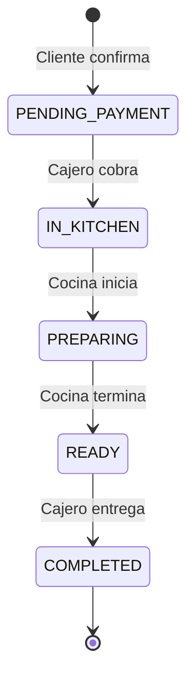
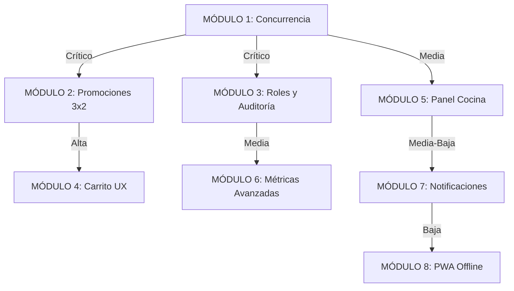

# 🍔 PLAN ESTRUCTURADO: 8 MÓDULOS PRIORITARIOS - KMS RESTAURANTE

**Proyecto:** Momoy's Burger - Sistema de Gestión de Pedidos  
**Fecha:** 2026-02-17  
**Arquitecto:** Kilo Code  

---

## 📊 ANÁLISIS DEL SISTEMA ACTUAL

### ✅ Interfaces Existentes Identificadas

1. **Bienvenida → Nombre Cliente** ([`public/index.html`](public/index.html:83-98))
   - Wizard de 4 pasos con progreso visual
   - Captura nombre del cliente
   - Acceso a staff protegido

2. **Comedor/Llevar → Menú → Carrito Editable** ([`public/carrito.html`](public/carrito.html:1-188))
   - Selección de tipo de servicio
   - Menú digital con categorías
   - Carrito flotante con contador
   - Edición de cantidades y eliminación

3. **Pre-checkout: Sugerencias 3x2 Promociones**
   - ⚠️ **PENDIENTE DE IMPLEMENTAR** (No existe actualmente)
   - Requerido antes de confirmar pedido

4. **Estado Pedidos** ([`public/index.html`](public/index.html:52-56))
   - Cliente ve progreso en tiempo real
   - Socket.io para actualizaciones instantáneas
   - Estados visuales animados

5. **Roles: Admin/Cajero/Cocina** ([`middleware/auth.js`](middleware/auth.js:1-53))
   - Sistema JWT implementado
   - Roles: `admin`, `cashier`, `cook`
   - Permisos por endpoint

6. **Admin: Métricas + Sugerencias** ([`routes/metrics.js`](routes/metrics.js:1-98))
   - Dashboard financiero
   - Top productos
   - Ventas por categoría
   - ⚠️ Sugerencias de ventas NO implementadas

### 🔄 Máquina de Estados Actual



**Modelo:** [`models/Pedido.js`](models/Pedido.js:13-18)

### ⚠️ GAPS CRÍTICOS IDENTIFICADOS

1. **Concurrencia de Pedidos:**
   - ❌ No hay sistema de cola de prioridad
   - ❌ No hay límite de pedidos simultáneos
   - ❌ No hay estimación de tiempos de espera
   - ❌ Posible race condition en `numeroOrden` ([`server.js`](server.js:74-80))

2. **Sistema de Promociones:**
   - ❌ No existe lógica de 3x2
   - ❌ No hay sugerencias pre-checkout
   - ❌ No hay validación de combos

3. **Roles y Permisos:**
   - ✅ JWT implementado correctamente
   - ⚠️ Falta auditoría de acciones
   - ⚠️ No hay logs de cambios de estado por usuario

---

## 🎯 PLAN DE 8 MÓDULOS PRIORITARIOS

### **MÓDULO 1: SISTEMA DE CONCURRENCIA Y COLA DE PEDIDOS** 🔥
**Prioridad:** CRÍTICA  
**Dependencias:** Ninguna  

#### Objetivos:
- Implementar cola de prioridad para pedidos concurrentes
- Agregar sistema de bloqueo optimista para `numeroOrden`
- Crear estimador de tiempos de espera
- Implementar límite configurable de pedidos simultáneos

#### Componentes a Crear:
```
models/
  └── OrderQueue.js          # Modelo de cola con prioridades
services/
  └── queue.service.js       # Lógica de gestión de cola
  └── time-estimator.js      # Estimación de tiempos
middleware/
  └── rate-limiter.js        # Límite de pedidos por cliente
```

#### Cambios en Archivos Existentes:
- [`server.js`](server.js:61-92): Integrar cola antes de guardar pedido
- [`models/Pedido.js`](models/Pedido.js:1-30): Agregar campos `queuePosition`, `estimatedTime`
- [`public/js/client.js`](public/js/client.js:1-7415): Mostrar posición en cola

#### Criterios de Éxito:
- ✅ 100 pedidos simultáneos sin colisión de `numeroOrden`
- ✅ Tiempo de espera estimado con ±5 min precisión
- ✅ Cola visible en panel de cocina

---

### **MÓDULO 2: MOTOR DE PROMOCIONES 3x2** 🎁
**Prioridad:** ALTA  
**Dependencias:** Ninguna  

#### Objetivos:
- Crear sistema flexible de promociones 3x2
- Implementar pantalla de sugerencias pre-checkout
- Validar automáticamente combos elegibles
- Calcular descuentos en tiempo real

#### Componentes a Crear:
```
models/
  └── Promotion.js           # Esquema de promociones
services/
  └── promotion.service.js   # Motor de cálculo de promos
routes/
  └── promotions.js          # API de promociones
public/
  └── pre-checkout.html      # Pantalla de sugerencias
  └── js/promotions.js       # Lógica cliente
```

#### Lógica de Negocio:
```javascript
// Ejemplo: 3x2 en hamburguesas
{
  tipo: "3x2",
  categoria: "hamburguesas",
  condicion: { minItems: 3 },
  descuento: { type: "free_item", value: 1 } // El más barato gratis
}
```

#### Integración:
- [`public/carrito.html`](public/carrito.html:88-90): Botón "Ver Promociones" antes de confirmar
- [`server.js`](server.js:61-92): Validar promociones aplicadas
- [`models/Pedido.js`](models/Pedido.js:1-30): Campo `promocionesAplicadas[]`

#### Criterios de Éxito:
- ✅ Cliente ve sugerencias basadas en carrito actual
- ✅ Descuento 3x2 aplicado automáticamente
- ✅ Total recalculado correctamente

---

### **MÓDULO 3: SISTEMA DE ROLES Y AUDITORÍA** 🔐
**Prioridad:** ALTA  
**Dependencias:** Ninguna  

#### Objetivos:
- Reforzar permisos granulares por acción
- Implementar log de auditoría completo
- Crear panel de actividad para admin
- Rastrear cambios de estado con usuario responsable

#### Componentes a Crear:
```
models/
  └── AuditLog.js            # Registro de acciones
middleware/
  └── audit.middleware.js    # Interceptor de acciones
routes/
  └── audit.js               # API de logs
public/
  └── audit-panel.html       # Vista de auditoría
```

#### Mejoras en Archivos Existentes:
- [`middleware/auth.js`](middleware/auth.js:1-53): Agregar `logAction()` middleware
- [`models/Pedido.js`](models/Pedido.js:21-27): Expandir `history` con más detalles
- [`server.js`](server.js:94-130): Registrar usuario en cada cambio de estado

#### Eventos a Auditar:
- Login/Logout de usuarios
- Cambios de estado de pedidos
- Modificaciones de menú/inventario
- Creación/eliminación de usuarios
- Aplicación de descuentos

#### Criterios de Éxito:
- ✅ Cada acción tiene timestamp + usuario + IP
- ✅ Admin puede filtrar logs por fecha/usuario/acción
- ✅ Reportes de actividad exportables

---

### **MÓDULO 4: OPTIMIZACIÓN DE CARRITO Y UX** 🛒
**Prioridad:** MEDIA-ALTA  
**Dependencias:** Módulo 2 (Promociones)  

#### Objetivos:
- Mejorar edición de carrito (cantidades, modificadores)
- Agregar validación de stock en tiempo real
- Implementar guardado automático (localStorage + sync)
- Crear resumen visual mejorado

#### Componentes a Crear:
```
public/
  └── js/cart-manager.js     # Clase centralizada de carrito
  └── js/cart-sync.js        # Sincronización con servidor
services/
  └── stock-validator.js     # Validación de disponibilidad
```

#### Mejoras en Archivos Existentes:
- [`public/carrito.html`](public/carrito.html:102-139): Refactorizar a componente reutilizable
- [`public/carrito.js`](public/carrito.js:1-1861): Migrar a clase `CartManager`
- [`server.js`](server.js:61-92): Endpoint `/api/cart/validate`

#### Funcionalidades Nuevas:
- Modificadores visuales (sin/con ingredientes)
- Sugerencias de combos mientras agrega items
- Validación de stock antes de confirmar
- Carrito persistente entre sesiones

#### Criterios de Éxito:
- ✅ Carrito sincronizado en tiempo real
- ✅ Validación de stock sin errores
- ✅ UX fluida en móvil y desktop

---

### **MÓDULO 5: PANEL DE COCINA MEJORADO** 👨‍🍳
**Prioridad:** MEDIA  
**Dependencias:** Módulo 1 (Cola)  

#### Objetivos:
- Vista optimizada para cocina (solo pedidos relevantes)
- Sistema de priorización visual
- Temporizadores por pedido
- Notificaciones sonoras configurables

#### Componentes a Crear:
```
public/
  └── kitchen-display.html   # Vista dedicada cocina
  └── js/kitchen.js          # Lógica específica
  └── css/kitchen.css        # Estilos optimizados
services/
  └── kitchen-timer.js       # Gestión de tiempos
```

#### Mejoras en Archivos Existentes:
- [`public/staff.html`](public/staff.html:55-58): Agregar modo "Vista Cocina"
- [`public/js/staff.js`](public/js/staff.js:72-121): Filtros por estado
- Socket.io: Eventos específicos para cocina

#### Funcionalidades:
- Vista de tarjetas grandes (legibles a distancia)
- Colores por urgencia (verde/amarillo/rojo)
- Temporizador desde que entra a cocina
- Botón "Marcar Listo" prominente
- Filtro por tipo (Comedor/Llevar)

#### Criterios de Éxito:
- ✅ Cocina ve solo pedidos IN_KITCHEN y PREPARING
- ✅ Alertas visuales/sonoras para pedidos urgentes
- ✅ Tiempo promedio de preparación reducido 15%

---

### **MÓDULO 6: DASHBOARD DE MÉTRICAS AVANZADAS** 📊
**Prioridad:** MEDIA  
**Dependencias:** Módulo 3 (Auditoría)  

#### Objetivos:
- Implementar sugerencias de ventas basadas en datos
- Crear gráficas interactivas (Chart.js)
- Análisis de horas pico
- Predicción de demanda

#### Componentes a Crear:
```
services/
  └── analytics.service.js   # Motor de análisis
  └── ml-suggestions.js      # Sugerencias inteligentes
public/
  └── js/charts.js           # Configuración de gráficas
  └── dashboard-advanced.html
```

#### Mejoras en Archivos Existentes:
- [`routes/metrics.js`](routes/metrics.js:1-98): Agregar endpoints de predicción
- [`controllers/metrics.controller.js`](controllers/metrics.controller.js:1-109): Lógica de sugerencias
- [`public/admin.js`](public/admin.js:1-100): Integrar gráficas

#### Sugerencias a Implementar:
- "Aumentar stock de X (se agota en 2 días)"
- "Promocionar Y (baja rotación)"
- "Hora pico: 14:00-16:00 (preparar más personal)"
- "Combo sugerido: Hamburguesa + Bebida (alta correlación)"

#### Criterios de Éxito:
- ✅ 5 sugerencias accionables diarias
- ✅ Gráficas de tendencias (7/30 días)
- ✅ Exportar reportes PDF

---

### **MÓDULO 7: SISTEMA DE NOTIFICACIONES** 🔔
**Prioridad:** MEDIA-BAJA  
**Dependencias:** Módulo 1 (Cola)  

#### Objetivos:
- Notificaciones push para clientes (pedido listo)
- Alertas para staff (nuevo pedido, stock bajo)
- Sistema de preferencias de notificación
- Integración con Web Push API

#### Componentes a Crear:
```
services/
  └── notification.service.js
  └── push-manager.js
models/
  └── NotificationPreference.js
public/
  └── js/notifications.js
  └── service-worker.js      # PWA
```

#### Integración:
- [`server.js`](server.js:156-162): Eventos Socket.io → Push
- [`public/index.html`](public/index.html:1-100): Solicitar permisos
- [`public/staff.html`](public/staff.html:1-100): Panel de configuración

#### Tipos de Notificaciones:
- Cliente: "Tu pedido #42 está listo"
- Cajero: "Nuevo pedido recibido"
- Cocina: "5 pedidos en cola"
- Admin: "Stock bajo: Pan para hamburguesa"

#### Criterios de Éxito:
- ✅ 90% de clientes reciben notificación
- ✅ Latencia < 2 segundos
- ✅ Configuración granular por usuario

---

### **MÓDULO 8: MODO OFFLINE Y PWA** 📱
**Prioridad:** BAJA  
**Dependencias:** Módulo 7 (Service Worker)  

#### Objetivos:
- Convertir app en PWA instalable
- Funcionalidad offline básica (ver menú)
- Sincronización automática al reconectar
- Cache inteligente de assets

#### Componentes a Crear:
```
public/
  └── manifest.json          # PWA manifest
  └── service-worker.js      # Cache strategy
  └── js/offline-manager.js  # Sync queue
```

#### Estrategia de Cache:
- **Cache First:** Imágenes, CSS, JS
- **Network First:** API de pedidos
- **Stale While Revalidate:** Menú

#### Funcionalidades Offline:
- Ver menú completo
- Agregar items al carrito
- Ver pedidos previos
- Sincronizar al reconectar

#### Criterios de Éxito:
- ✅ App instalable en móvil
- ✅ Funciona sin conexión (lectura)
- ✅ Lighthouse PWA score > 90

---

## 📋 RESUMEN DE PRIORIDADES



### Orden de Implementación Recomendado:

1. **FASE 1 (Crítica):** Módulos 1, 2, 3
2. **FASE 2 (Alta):** Módulos 4, 5
3. **FASE 3 (Media):** Módulos 6, 7
4. **FASE 4 (Mejoras):** Módulo 8

---

## 🔧 CONSIDERACIONES TÉCNICAS

### Stack Tecnológico Actual:
- **Backend:** Node.js + Express + MongoDB
- **Frontend:** Vanilla JS + Bootstrap 5
- **Real-time:** Socket.io
- **Auth:** JWT + bcrypt

### Recomendaciones:
- ✅ Mantener arquitectura actual (no refactorizar)
- ✅ Agregar TypeScript gradualmente (opcional)
- ✅ Implementar tests unitarios (Jest)
- ✅ Documentar APIs con Swagger

### Riesgos Identificados:

| Riesgo | Impacto | Mitigación |
|--------|---------|------------|
| Race condition en `numeroOrden` | Alto | Implementar transacciones MongoDB |
| Sobrecarga de Socket.io | Medio | Implementar rooms por rol |
| Validación de stock lenta | Medio | Cache Redis para inventario |
| Promociones complejas | Bajo | Motor de reglas flexible |

---

## 📊 MÉTRICAS DE ÉXITO

### KPIs por Módulo:

1. **Concurrencia:** 0 colisiones en 1000 pedidos
2. **Promociones:** 30% de pedidos con 3x2 aplicado
3. **Auditoría:** 100% de acciones registradas
4. **Carrito:** Tasa de abandono < 10%
5. **Cocina:** Tiempo promedio -15%
6. **Métricas:** 5 sugerencias/día con 70% precisión
7. **Notificaciones:** 90% entrega exitosa
8. **PWA:** Lighthouse score > 90

---

## 🚀 PRÓXIMOS PASOS

1. **Revisar y aprobar este plan**
2. **Priorizar módulos según necesidad de negocio**
3. **Crear issues/tickets por módulo**
4. **Asignar recursos y tiempos**
5. **Iniciar implementación Fase 1**

---

## 📝 NOTAS ADICIONALES

### Respeto a Interfaces Existentes:
- ✅ Wizard de 4 pasos se mantiene intacto
- ✅ Estados de pedido respetados (solo se agregan campos)
- ✅ Roles actuales compatibles (se expanden permisos)
- ✅ Socket.io se extiende (no se reemplaza)

### Promociones 3x2 - Regla de Negocio:
```javascript
// SIEMPRE aplicar el descuento al item más barato
function calcular3x2(items) {
  if (items.length < 3) return 0;
  const sorted = items.sort((a, b) => a.precio - b.precio);
  return sorted[0].precio; // El más barato gratis
}
```

### Estados de Pedido - Flujo Completo:
```
RECIBIDO (PENDING_PAYMENT)
    ↓ Cajero cobra
PREPARANDO (IN_KITCHEN → PREPARING)
    ↓ Cocina termina
LISTO (READY)
    ↓ Cajero entrega
ENTREGADO (COMPLETED)
```

---

**Documento generado por:** Kilo Code - Architect Mode  
**Versión:** 1.0  
**Última actualización:** 2026-02-17
